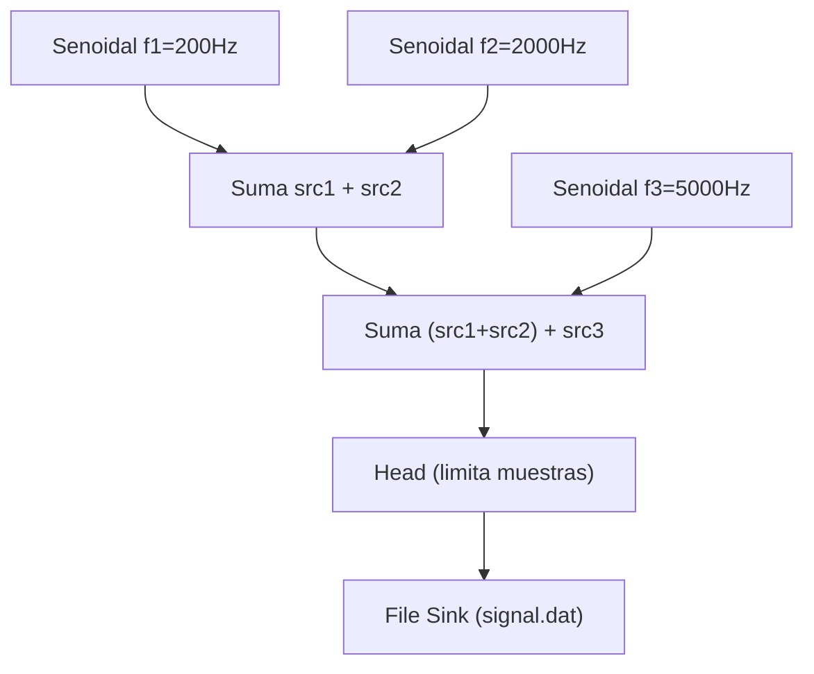

# Implementación de filtros digitales con GNU Radio

En esta carpeta voy a colocar notas en formato markdown con ejemplos de diferentes filtros digitales disponibles en GNU Radio.

* [Filtro Pasa-Bajas FIR](https://github.com/rescurib/gnu_radio_playground/blob/main/Filtros/fir_pasa_bajas.md)
* [Filtro Pasa-Bajas IIR](https://github.com/rescurib/gnu_radio_playground/blob/main/Filtros/iir_pasa_bajas.md)

## Bloque de generación de señal.

La API de GNU Radio usa constantemente una característica de C++ llamada [Plantillas de Clase](https://learn.microsoft.com/es-es/cpp/cpp/templates-cpp). Es muy importante entender este concepto o será muy confuso utilizarla. [Aquí](https://www.youtube.com/watch?v=mQqzP9EWu58) hay un video conciso y bueno.

`sig_source`[[doc](https://www.gnuradio.org/doc/doxygen/classgr_1_1analog_1_1sig__source.html)] es una platilla de clase que nos permite instanciar generadores de señales de diferentes tipos de datos. La manera en la que la documentación oficial presenta las diferetes plantillas me parece confusa así que suelo referir directamente al archivo de header [sig_source.h](https://www.gnuradio.org/doc/doxygen/sig__source_8h_source.html) en donde podemos ver los siguientes:

```C++
 typedef sig_source<std::int8_t> sig_source_b;
 typedef sig_source<std::int16_t> sig_source_s;
 typedef sig_source<std::int32_t> sig_source_i;
 typedef sig_source<float> sig_source_f;
 typedef sig_source<gr_complex> sig_source_c;
```
Por ejemplo, para crear una fuente senoidal de tipo *float*:

```C++
#include <gnuradio/analog/sig_source.h>

const float fs = 44000.0f; 
float f1 = 200.0f;   
auto src_sin = gr::analog::sig_source_f::make(
                 fs, /* Frec. de muestreo*/
                 gr::analog::GR_SIN_WAVE, 
                 f1,  /* Frec. de señal */
                 1.0, /* Amplitud*/
                 0.0,  /* Offset de amplitud */
                 0.0, /* Fase inicial */
               );
```

## Bloque Head

Si queremos que el flujo se detenga después de un número definido de muestras, necesitamos el bloque `head`[[doc](https://www.gnuradio.org/doc/doxygen/classgr_1_1blocks_1_1head.html)]. 

Por ejemplo, para procesar solo los primeros 20 ms de la señal del ejemplo anterior:

```C++
#include <gnuradio/blocks/head.h>

const float fs = 44000.0f;   // Frecuencia de muestreo
const int tiempo_final = 40; // Tiempo final en ms
const int num_muestras = static_cast<int>(fs * tiempo_final / 1000.0f);

// Limitador de muestras
auto head = gr::blocks::head::make(sizeof(float), num_muestras);
```
## Sumidero de archivo

En varios de los ejemplos de filtros digitales enviaremos las señales procesadas a un archivo binario de tipo .dat. Pero primero debemos añadir un header que contenga la información necesaria para poder post-procesarla con Octave o Python.

`Nota`. Se que existe un sumidero de archivo especial llamado [file_meta_sink](https://www.gnuradio.org/doc/doxygen/classgr_1_1blocks_1_1file__meta__sink.html) que permite añadir esta información pero aún sigo tratando de entenderlo. Podré una nota acá cuando lo haga.

Por ahora podemos crear un binario con header customizado y después crear un sumidero de archivo convencional:

```C++
#include <iostream>
#include <chrono>
#include <gnuradio/blocks/file_sink.h>

// Escribir header personalizado en signal.dat
std::ofstream outfile("signal.dat", std::ios::binary | std::ios::trunc);
if (outfile.is_open()) 
{
    outfile << "fs=" << fs << "\n";
    outfile << "datatype=float\n";
    outfile << "datasize=" << sizeof(float)*1 << "\n";
    auto now = std::chrono::system_clock::now();
    auto now_sec = std::chrono::duration_cast<std::chrono::seconds>(now.time_since_epoch()).count();
    outfile << "timestamp=" << now_sec << "\n";
    outfile.close();
} else 
  {
    std::cerr << "No se pudo abrir signal.dat para escribir el header." << std::endl;
    return 1;
  }

// Sink de archivo para una señal
auto sink = gr::blocks::file_sink::make(sizeof(float)*1, "signal.dat", true); // true: append mode
```

## Uniendo todas las piezas

El programa [generador.cpp](https://github.com/rescurib/gnu_radio_playground/blob/main/Filtros/generador.cpp) crea y combina 3 generadores de señales senoidales, toma 20 o 40 ms de muestras y las guarda en un binario. El diagrama de bloques del flujo implementado es el siguiente:


La señal en el archivo binario puede ser graficado usando [GNU Octave](https://www.octave.org/) con el script [signal_ploter.m](https://github.com/rescurib/gnu_radio_playground/blob/main/Filtros/signal_plotter.m) :

<p align="center">

<p>
